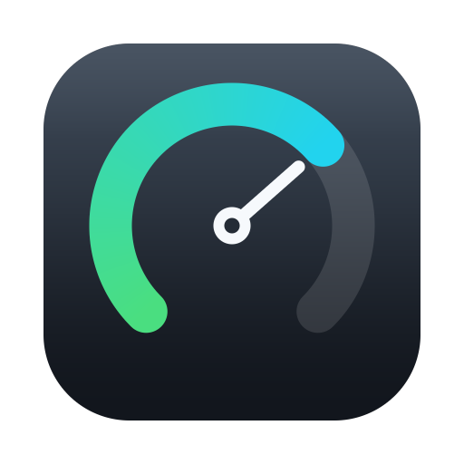
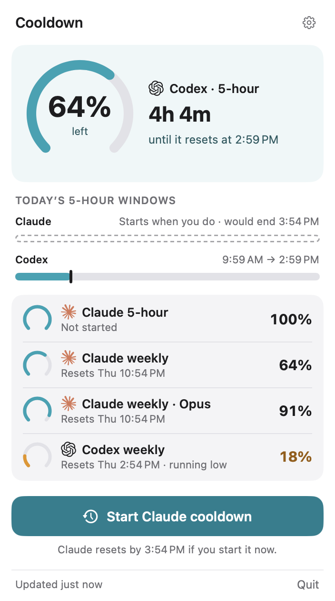
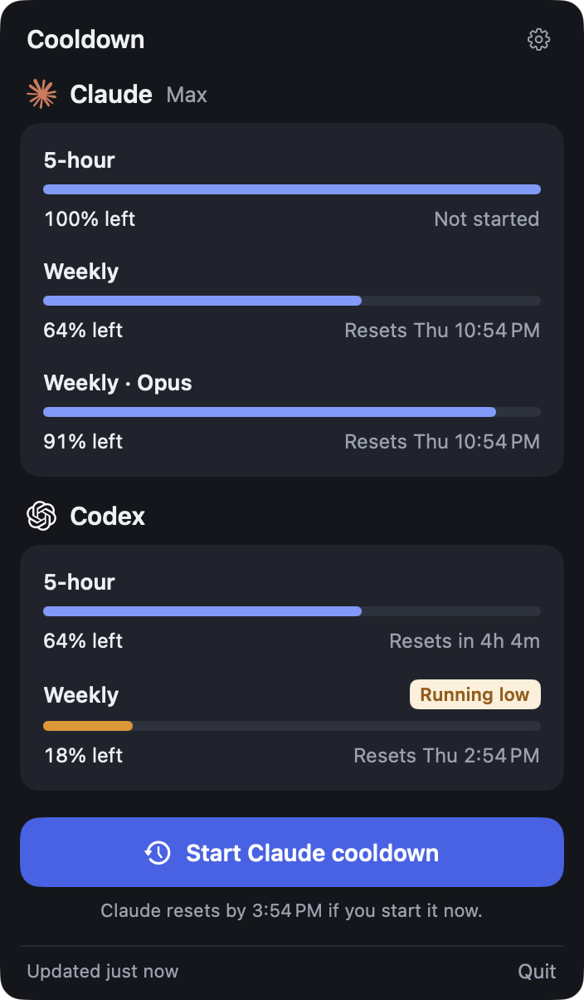
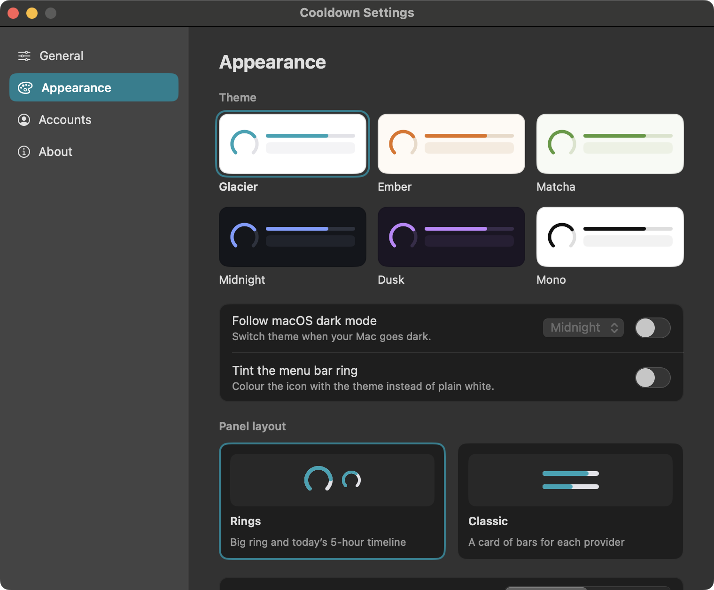

<div align="center">



# Cooldown

**See how much Claude and Codex you have left, and start the 5-hour cooldown
before you sit down to work.**

</div>

---

## What it looks like

It sits in the menu bar as a ring that drains as the tightest 5-hour window runs down.

<p align="center">
  
</p>

Click it for every window, how long until each one comes back, and one button that
starts the 5-hour cooldown early so it is already running when you get to work. The
button is live only while the 5-hour window is still full, since there is nothing to
start once the clock is running.

<p align="center">
  
</p>

There is also a Classic layout, a card of bars for each provider, and six themes.

<p align="center">
  
</p>

<p align="center">
  
</p>

---

## Install

macOS 14 or later, and the Xcode command line tools (`xcode-select --install`).

```bash
git clone https://github.com/arunsabaratnam/cooldown.git
cd cooldown
./scripts/build-app.sh
open build/Cooldown.app
```

To keep it, drag it into Applications:

```bash
cp -R build/Cooldown.app /Applications/
```
