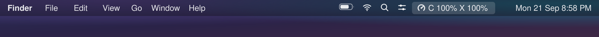
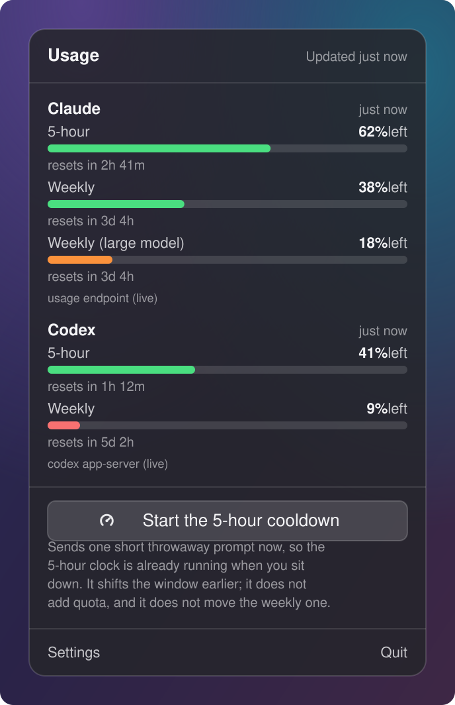

<div align="center">


# Cooldown

**See how much Claude and Codex you have left, and start the 5-hour cooldown
before you sit down to work.**

</div>

---

## What it looks like

It sits in the menu bar and shows what is left of each 5-hour window.

<p align="center">
  
</p>

Click it for every window, how long until each one comes back, and one button that
starts the 5-hour cooldown early so it is already running when you get to work.

<p align="center">
  
</p>

---

## Install

macOS 14 or later, and the Xcode command line tools (`xcode-select --install`).

```bash
git clone https://github.com/arunsabaratnam/cooldown.git
cd cooldown
./scripts/build-app.sh
open build/Cooldown.app
```

To keep it, drag it into Applications:

```bash
cp -R build/Cooldown.app /Applications/
```

<div align="center">

[How it works](docs/how-it-works.md)

</div>
